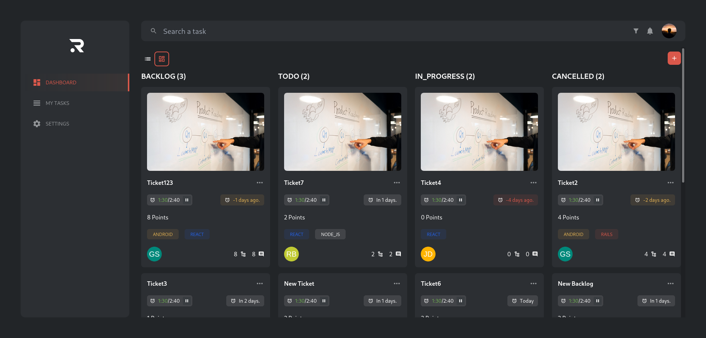
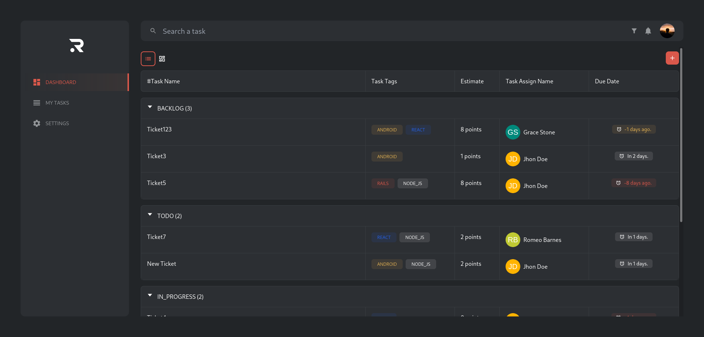
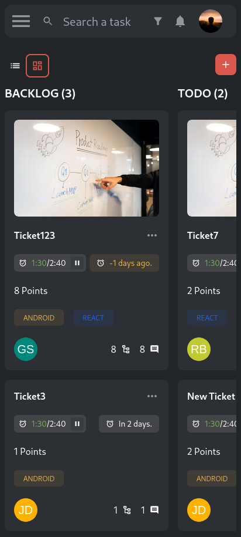
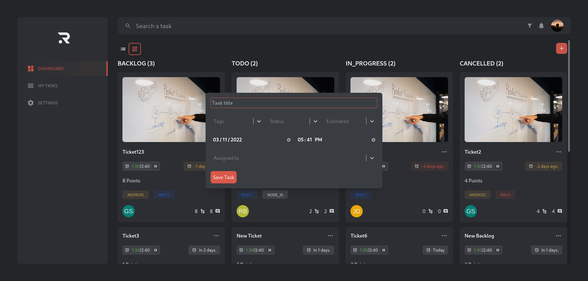
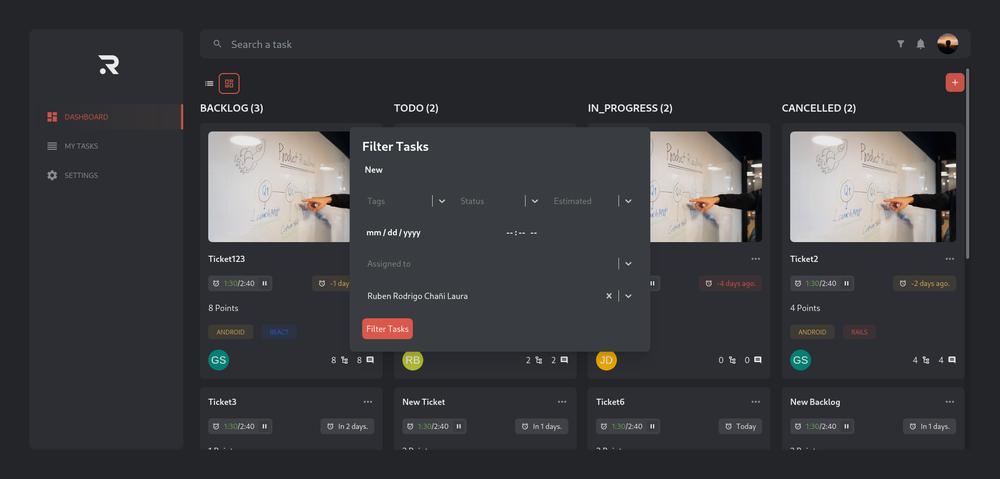
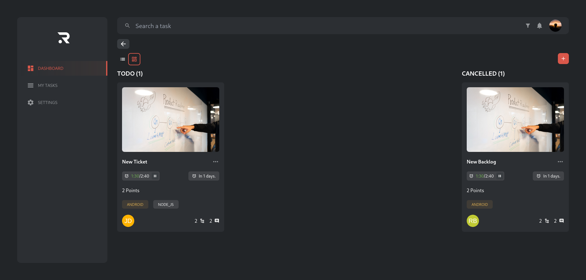
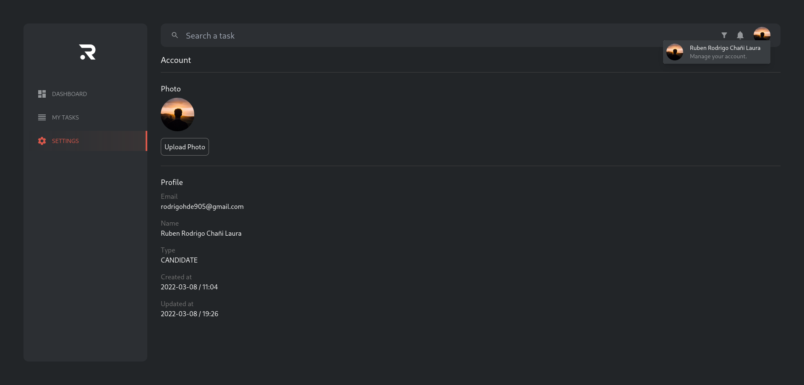

# Getting Started with RAVN - CRUD

## Available Scripts
First of all, this project uses `enviroment variables`, so you need set up in the .env file or in your deployment enviroment.
In the .env file you will the necessary variables .

In the project directory, you can run:

### `npm start`

Runs the app in the development mode.\
Open [http://localhost:3000](http://localhost:3000) to view it in the browser.

The page will reload if you make edits.\
You will also see any lint errors in the console.

### `npm run build`

Builds the app for production to the `build` folder.\
It correctly bundles React in production mode and optimizes the build for the best performance.

The build is minified and the filenames include the hashes.\
Your app is ready to be deployed!

## Description
This project is a Task Management application which is similar to apps like Trello.

### What can we do in this application?
* Create Tasks: With the red button we can add tasks. We need to put the correct information. Here we have Tags Select(we can choose one or more), Status Select, Estimated Select, Date and Time and UserSekect (we can choose one user. This is an async select, so we have all users).
In every task we have an three-point button that we can use to display the available actions like Update and Delete.
* Update Tasks: This option will display a Form Task with the current task data. We can change everything and save the task.
* Delete Tasks: This option will display a Delete Form Task that is an confirmation form.
* Search Tasks: In the navbar we have an Search Input. This input will search for all Tasks that match the typed word.
* Filter Tasks: In the navbar we have an Filter Button. This button will display an FilterFormTask that is used to make a more advanced filter of tasks.
* Display tasks in Column and List layout: We can choose between displaying tasks in columns or rows.

## App working
#### Board Dashboard

#### List Dashboard

#### Mobile Dashboard

#### Form Task

#### Form Filter

#### Filter results

#### User Information

## Project Structure
### Folder Structure
* assets: Folder with common files like images or svg.
* components: Common components for the application.
* context: Here we have the contexts used in the app.
* helpers: Common functions that will be used in parts of the application
* hooks: Custom hooks to separate logic from the components
* interfaces: How we are using Typescript, here we have the interfaces and typos for: Models, Functions, Forms, etc.
* pages: Components that serve as pages in the application.
* routes: Router configuration. Here we could add a protectRoutes in case we have sessions for users.
* services: In this directory we have files used to generate an abstraction of our http requests. In this way we get this logic out of the components.
* providers and reducer: Here we have the logic necessary for our reducers (single source of truth).

### Reducer and ContextAPI
To handle the states shared in multiple and depth level components, I decided to use this aproach, in this way I have an global state which can be accessed from anywhere in the application. This solution simulates the pattern used with redux applications.

## Tecnologies used
* React: This is the main technology for this project.
* Typescript: I used typescript because for the static typing it offers. It allows me to quickly detect errors and have a better autocomplete in the application.
* react-router-dom@v6: Library to navigate between pages in react. This is the most used library, so there are a lot of resources.
* Axios: Because it has interceptors which can be used to create an instance with all configurations.
* Formik and Yup: Both are used to avoid tedius form validation. 
* react-select: To handle list values such as Users (assigned to).
* react-hot-toast: A simple library used to display a toast on actions taken by users.
* react-icons: Multiple icons used in the application.
* tailwindcss: A CSS framework that allows to quickly stylize the application. I also use it for the theme configuration. In tailwind.config.js there are design system colors used in the app.
* headlessui: This library is a good complement to TailwindCss because it provides common components that are used in web applications.
## Other
### Aditional features:
* List Dashboard view.
* Search Navbar with debouncer.